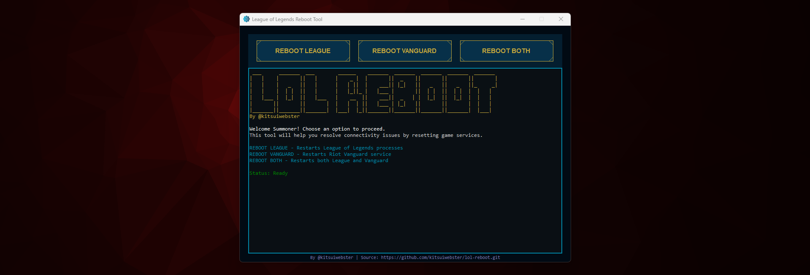

# LOL-REBOOT

Is your **League of Legends client** or **Vanguard anti-cheat** constantly crashing, freezing, or refusing to start? These PowerShell scripts help you reset them cleanly and quickly — no more hunting down rogue processes or restarting your PC. 💥

## 📥 Application Installation (Recommended)



### Simple GUI Version

For the easiest experience, download the user-friendly application:

1. **Download the installer**:
   * Go to the [Releases](https://github.com/kitsuiwebster/lol-reboot/releases) page
   * Download the latest `LoLRebootSetup.exe` file

2. **Install the application**:
   * Run the downloaded `LoLRebootSetup.exe`
   * Follow the installation prompts
   * The application will install to your computer

3. **Launch LOL-REBOOT**:
   * Open the installed application from your Start menu or desktop shortcut
   * The program provides three simple buttons:
     * **Reset League** - Restarts all League of Legends processes
     * **Reset Vanguard** - Restarts the Vanguard anti-cheat service
     * **Reset Both** - Restarts both League and Vanguard at once

4. **Just click the appropriate button** whenever you need to reboot either LoL, VGC or both.

> 💡 **Note**: The application automatically runs with admin privileges needed to restart the services.

## 📁 Standalone Powershell Scripts

### `ResetLeague.ps1`

Stops all League of Legends-related processes:

* `LeagueClientUx`
* `RiotClientServices`
* `LeagueClient`

Then restarts the Riot and League clients.

### `ResetVGC.ps1`

Stops and restarts the **Vanguard anti-cheat service** (`vgc`).
Perfect if you're having trouble launching **Valorant** due to Vanguard issues.

### `ResetLeague+VGC.ps1`

A combo of both: resets **League** and **Vanguard** at once.

---

## ⚡ How to Use

### 1. Open PowerShell as Administrator

* Press **Windows Key**
* Type `powershell`
* Right-click **Windows PowerShell** → **Run as Administrator**

### 2. Run a Script with This Command:

```powershell
powershell.exe -ExecutionPolicy Bypass -File "C:\Users\YourName\Script.ps1"
```

Replace:

* `Script.ps1` with one of:

  * `ResetLeague.ps1` (resets League of Legends)
  * `ResetVGC.ps1` (resets Vanguard anti-cheat)
  * `ResetLeague+VGC.ps1` (resets both League and Vanguard)
* `YourName` with your actual **Windows username**

> 💡 Example:
>
> ```powershell
> powershell.exe -ExecutionPolicy Bypass -File "C:\Users\raphm\Downloads\ResetVGC.ps1"
> ```

---

## ⚠️ Requirements

* Run scripts as **Administrator** (needed to control system services like Vanguard)
* Works on **Windows** with **PowerShell 5.1 or higher**

